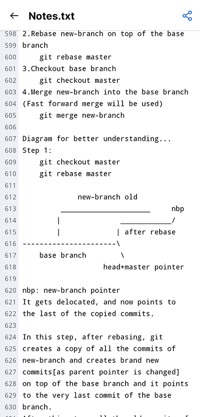

# Git Revision Notes
## Revise git anywhere

Sample of view on Github Mobile App:

This is my revision note for Git. I think git is something that every developer should know.\
Also it is being widely used in the industry. So it's better to have proper knowledge about it.\
I update it regularly when I learn something new.\
I've also included the basic git concepts, so that a beginner can also follow this.\
Also the indentation of the file is kept in such a way that the content can be best viewed on Github\
mobile app so that you can read it on the go.